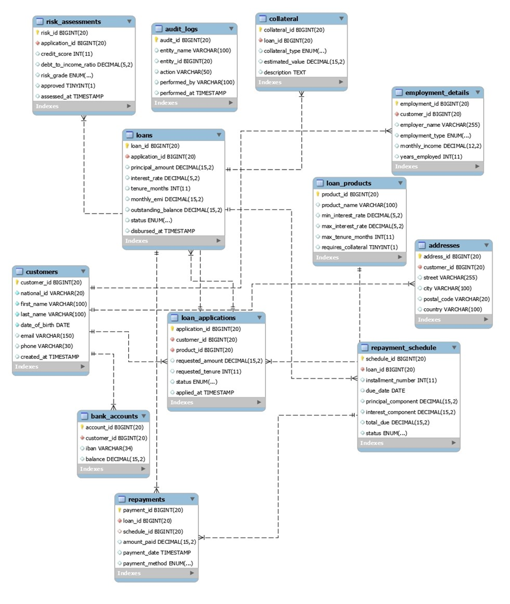
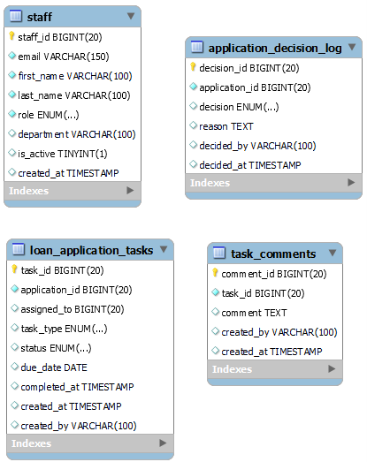
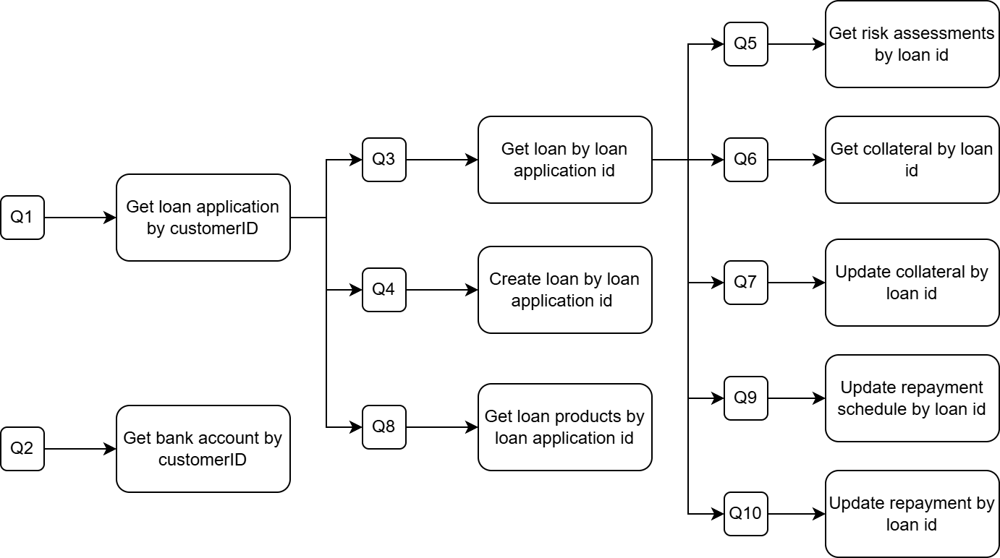
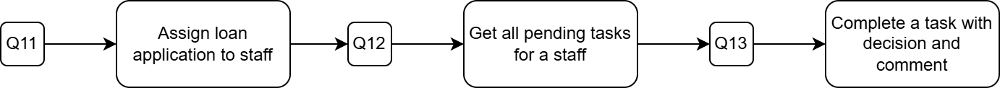
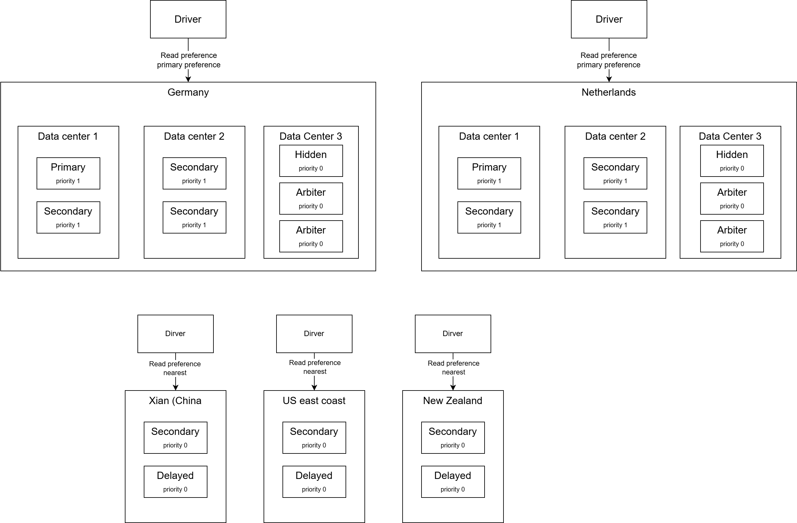
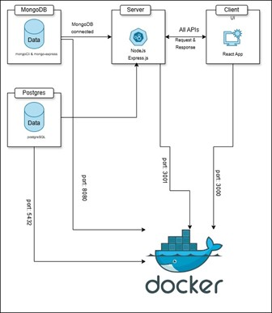

# Loan banking service

## Description 

The business domain is an online banking service that strives to select the correct customers for loaning, track the loan, and estimate risks. The bank will check the customer’s profile, the loan application, and the loan product. Then the bank will ensure that the customer pays on time with the least risk possible. 

## DBMS

- MongoDB version 8.0
- PostgreSQL version 

## Database structure

The initial database structure contains of customers information, loan_applications, loans, repayments and risk assessments. With this structure, the bank can retrieve loan application and access the repayment's schedule based on each customer

The additional structure adds the staff's information and tasks, which can be assigned to the staff. Staff can make decisions and comments on specific tasks.

## Use case design 

First 10 use cases applied to first database structure, where read/write operations have ratio of 60/40.

3 additional use cases support the additional data structure in which user can assign loan application to staff, and staff can complete tasks.

## Data distribution

This is data distribution across 5 countries. Our business domain mainly focuses on storing loan applications, customer’s information and tracking repayments. Therefore, our data distribution mainly focuses on replication of data. Our focus also helps user migrate their data to other banking system, so replication will help provide up-to-date accurate data to other banking systems

## Application architecture

This server can connect to more than one database at the same time. Each database works independently, and the server chooses which one to use for different data or tasks. This allows the application to store data in different ways, stay organized, and handle more users efficiently.

We use MongoDB and PostgreSQL together. MongoDB handles flexible, document-based data, while PostgreSQL stores structured, relational data. The server connects to both databases and decides which one to use depending on the type of data or operation. This setup allows the application to manage different kinds of data efficiently and stay organized.
